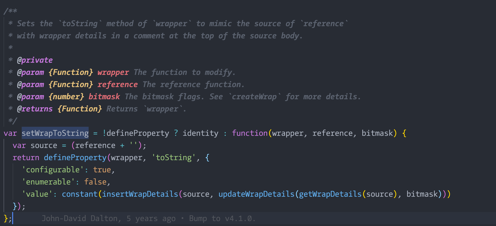

# 柯里化学习

参考文章：

1. [柯里化与反柯里化:https://juejin.cn/post/6844903645222273037](https://juejin.cn/post/6844903645222273037)
2. [「前端进阶」彻底弄懂函数柯里化:https://juejin.cn/post/6844903882208837645](https://juejin.cn/post/6844903882208837645)
3. [这些高阶的函数技术，你掌握了么:https://juejin.cn/post/6892886272377880583](https://juejin.cn/post/6892886272377880583)
4. 掘金柯里化搜索：https://juejin.cn/search?query=%E6%9F%AF%E9%87%8C%E5%8C%96&type=2

<br /><br />

上面这些文章看完了，其实已经能够完全理解什么是 `柯里化` ，怎么写柯里化的代码。再去看看面试的题目基本计算完成这些学习了！

下面是一些自己的笔记，学习过程中茅塞顿开的感觉。

<br /><br />

我现在的疑问：`().add(1).add(2)` 这样怎么搞的？

<br />

看了第一篇文章以后，对柯里化基本的概念已经能理解了。

柯里化的参数保存；

延迟执行；

剩余参数的接收。

都是可以的。

但是他的实现只能说是入门，能够实现，但是不能用在生产环境。参数的处理还是不好！

<br />

于是我去看了 lodash 对柯里化的实现：

一个大佬对 `lodash - curry` 源码的解析：[lodash 源码学习 curry,curryRight](https://www.cnblogs.com/wandiao/p/7188588.html)

这里还有 `张鑫旭` 大佬解释的 柯里化 的概念：JS 中的柯里化(currying) https://www.zhangxinxu.com/wordpress/2013/02/js-currying/

<br />

看了 lodash 实现的 curry 方法，感觉特别复杂，中加有很多包装的方法，最核心柯里化实现技术架构，我感觉没有看的很清楚。但是我可以确定一个点：

**lodash 的柯里化对函数的参数看的很重，函数参数的个数，要么是用户自己传的，要么取函数定义时候的个数（Function.length）。在参数没有积累达到目标个数之前，lodash 会一直返回一个柯里化的函数。直到用户积累足够的参数，lodash 会立马求值。然后整个过程结束！**

<br />

现在我对：`add(1)(2,3)(4)` 的实现已经能够理解了，但是做的还没有 lodash 这么好，对于参数缓存，我的做法没有处理好，这个点可以借鉴 lodash 的做法，返回一个新的函数，让参数更合理一些！

<br />

这也就是第二篇文章的内容：

他带我实现了一个类似 lodash - curry 一样的 柯里化函数。

需要像这样，再包一层：

```javascript
function createCurrying(fn, len = fn.length) {
  return curryingWrap.call(this, fn, len);
}
function curryingWrap(fn, len, ...args) {
  return function next(...params) {
    const _args = [...args, ...params];
    if (_args.length >= len) {
      return fn.apply(null, _args);
    } else {
      return curryingWrap.call(this, fn, len, ..._args);
    }
  };
}

const addCurrying = createCurrying(add);
console.log(addCurrying(1)(2, 3));
```

在看懂第二篇文章的思路以后，自己跟着做了一遍，在中途调试的过程，我理解了 lodash 源码，对柯里化最后一个的包装：



<br />

有了这个包装，在控制台输出的时候，就不会把整个实现的源代码都暴露出来了，直接给一个封装过后的提示消息！

真是妙呀！

<br />

到此，我感觉基本看懂了柯里化的奥妙。

但是对于 lodash 站位参数的奥妙，我只是大概知道怎么做的。但是没有动手写代码。后面补上这个！

<br />

回顾文章，开头说的那个联式调用的问题，通过柯里化的学习并没有找到实现的方法。很是迷惑！

<br />

补充：看了第三篇文章以后，明白到，第一篇文章和第二篇文章实现的其实是两种东西：

第一篇文章其实实现的不是柯里化，而是 `偏函数` 一种和柯里化概念很像的函数使用方式。

而第二种实现的才是正真的柯里化！

<br />

对于这个问题：我现在的疑问：`().add(1).add(2)` 这样怎么搞的？

我查了一下，应该不算是柯里化的内容！！！

这个因该算是 `函数式编程` 的概念！

一个大佬对于链式调用的一些实现做了介绍，我觉得不错：

https://www.cnblogs.com/WindrunnerMax/p/14043455.html

其实这个问题，在看到一个经典的面向对象的面试题目：[lazyMan 面试题](https://blog.csdn.net/qq_39261142/article/details/110425286?utm_medium=distribute.pc_relevant.none-task-blog-2%7Edefault%7EBlogCommendFromBaidu%7Edefault-6.control&depth_1-utm_source=distribute.pc_relevant.none-task-blog-2%7Edefault%7EBlogCommendFromBaidu%7Edefault-6.control)

可以看的很清楚，这个几个最基本的实现就是一个链式调用和执行顺序！

<br /><br />

## 总结

所以，至此，柯里化的内容几乎都看完了。

其实以前很讨厌柯里化这种技巧，因为涉及到闭包，有时候一个很简单的功能，用柯里化会变的很复杂。

但是现在我对他的评价是中性的，因为了解柯里化的好和不好，我更能分得清什么场景应该用什么。其实也是对代码的控制更精进了一些。
