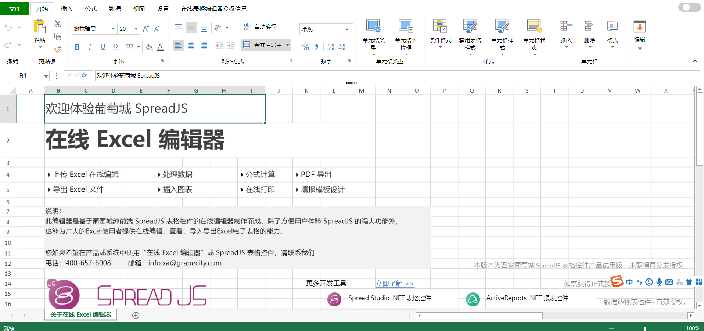

# SpreadJS-纯前端表格控件技术

### 一、SpreadJS 介绍

**官网介绍**：SpreadJS 是一款基于 HTML5 的纯前端表格控件，兼容 450 多种 Excel 公式，具备“高性能、跨平台、与 Excel 高度兼容”的产品特性，备受华为、明源云、远光软件等知名企业青睐，被中国软件行业协会认定为“中国优秀软件产品”。SpreadJS 在界面和功能上与 Excel 高度类似，但又不局限于 Excel，而是为企业信息化系统提供 表格文档协同编辑、 数据填报 和 类 Excel 报表设计 的应用场景支持，极大降低了企业研发成本和项目交付风险。

**总的来说**：spread.js 就是一款功能布局与 Excel 高度相似，且可嵌入你系统的纯前端表格控件。它可直接在 React、Angular、 Vue 等前端框架中使用，内置开放的 API 和类 Excel 的 UI 设计元素（如工具面板）。



在上图中，上方工具栏的部分属于葡萄城设计器的内容，目前葡萄城的设计器是不开源的，然而葡萄城提供的 api 基本支持我们完全复现它设计器所具有的所有功能

### 二、安装

**npm**</br>
`npm install @grapecity/spread-sheets-react @grapecity/spread-sheets `</br>
**yarn**</br>
`yarn add @grapecity/spread-sheets //核心功能模块依赖`</br>
`yarn add @grapecity/spread-sheets-react //React SpreadJS 控件依赖`</br>
除此之外还可以添加以下依赖：</br>
@grapecity/spread-sheets-languagepackages -------语言包</br>
@grapecity/spread-sheets-resources-zh -------------汉化包</br>
@grapecity/spread-excelio ---------------------------excel 文导入导出（需购买授权）</br>
@grapecity/spread-sheets-pdf -----------------------导出为 pdf
​

### 三、React 项目中基本使用

**3.1 SpreadSheets 组件初始化**

```jsx
import React, { useEffect } from 'react';
import * as GC from '@grapecity/spread-sheets';
import { SpreadSheets } from '@grapecity/spread-sheets-react';
import '../node_modules/@grapecity/spread-sheets/styles/gc.spread.sheets.excel2013white.css';
function ExcelDemo() {
  const initSpread = (spread) => {
    //工作簿初始化时执行该方法
    //搭配spread.toJSON和spread.formJSON方法可用于导出用于存储的模板JSON文件和加载已保存的模板
    let sheet = spread.getActiveSheet();
    //Setting Values - Text
    sheet.setValue(1, 1, 'Setting Values');
    //Setting Values - Number
    sheet.setValue(2, 1, 'Number');
    sheet.setValue(2, 2, 23);
    sheet.setValue(3, 1, 'Text');
    sheet.setValue(3, 2, 'GrapeCity');
    sheet.setValue(4, 1, 'Datetime');
    //Setting Values - DateTime
    sheet.getCell(4, 2).value(new Date(2020, 10, 7)).formatter('mm-dd-yyyy');
  };
  return (
    <div>
      <SpreadSheets
        hostStyle={{ width: '100%', height: '600px' }}
        workbookInitialized={(spread) => this.initSpread(spread)}
      ></SpreadSheets>
    </div>
  );
}
export default ExcelDemo;
```

通过以上的代码，可以通过引入`<SpreadSheets/>`组件的方法快速在项目中搭建起带有 excel 控件及功能的前端页面，其中通过 workbookInitialized 属性，你可以在组件初始化时就获取到组件的 spread 对象，从而对组件进行一些初始化操作。
上面的代码中：

（1）spread 对象代表的是当前操作的工作簿对象。我们对 excel 区域的一切操作都与它息息相关

（2）通过 spread.getActiveSheet()可以快速获取到当前激活的 sheet 页，从而对表单进行一些列入 setValue(设置某个单元格的值)，getValue(获取某个单元格的值)等操作
​

**3.2 excel 模板的保存**

通过上面的代码示例，在项目中快速搭建起 excel 页面后，我们就可以在页面上进行一些 Excel 所具有的操作了，那随之而来的问题就是我们操作完之后的数据如何与后端交互从而将操作之后的 excel 模板存进数据库呢？对此 spread 提供了两个 API，分别是 spread.toJSON()和 spread.formJSON()。

**toJSON()**</br>
该方法用于将 spread 对象状态保存为 JSON 字符串，下面是一个简单的模板转为的 JSON 字符串：

```json
{
  "version": "12.0.6",
  "sheets": {
    "Sheet1": {
      "name": "Sheet1",
      "theme": "Office2007",
      "data": {
        "defaultDataNode": {
          "style": {
            "themeFont": "Body"
          }
        }
      },
      "rowHeaderData": {
        "defaultDataNode": {
          "style": {
            "themeFont": "Body"
          }
        }
      },
      "colHeaderData": {
        "defaultDataNode": {
          "style": {
            "themeFont": "Body"
          }
        }
      },
      "selections": {
        "0": {
          "row": 0,
          "rowCount": 1,
          "col": 0,
          "colCount": 1
        },
        "length": 1
      },
      "index": 0
    }
  }
}
```

通过将模板 Json 存入数据库就可实现模板的持久化存储了

**formJSON()**</br>
该方法用于从指定的 JSON 字符串加载 spread 对象状态，一般在 workbookInitialized 时的回调中调用 spread.formJSON 来加载存储的模板。

```jsx
const initSpread = (spread) => {
  spread.fromJSON(layoutJSON); //将存储的json数据作为入参传入
};
<div>
  <SpreadSheets
    hostStyle={{ width: '100%', height: '600px' }}
    workbookInitialized={(spread) => this.initSpread(spread)}
  ></SpreadSheets>
</div>;
```

**3.3 数据绑定**

SpreadJS 支持绑定数据源，分为表单级绑定、单元格级绑定、表格绑定、这里我着重介绍一下单元格级绑定。
在我们的项目中，可能会存在这样的需求，用户管理员制作的一张 excel 模板需要分发给其他普通用户进行填写，但最终用户管理员只关心填写的表单数据的内容，并且想将这些表单的字段的值，进行汇总和分析，对于这种情况，如果我们使用 spread.toJSON 的方式来存储模板，并想从这个复杂的 JSON 文件中获取到真正有用的表单数据的值是非常困难的，因此我们可以使用数据绑定的方式来解决这一问题。</br>
**单元格级绑定**
首先必须创建一个单元格级别绑定的数据源, 然后使用 **setBindingPath** 方法来设置绑定路径到指定的单元格，并将数据源设置到表单上，列如：

```jsx
const person = {
  name: 'Wang feng',
  age: 25,
  sex: 'male',
  address: { postcode: '710075' },
}; //声明一个带有{key:value}的数据结构对象
const source = new GC.Spread.Sheets.Bindings.CellBindingSource(person); //声明CellBindingSource对象
sheet.setBindingPath(2, 1, 'name'); //将数据对象的key值绑定到具体的单元格
sheet.setBindingPath(3, 1, 'age');
sheet.setBindingPath(4, 1, 'sex');
sheet.setBindingPath(5, 1, 'address.postcode');
sheet.setDataSource(source);
//绑定完成之后，单元格的值将变成你所传入的数据对象的key所对应的值
```

绑定完成之后你就可以通过 getBindingPath(row,col)方法来获取某一个被进行了数据绑定的单元格的信息，但通过这样的方式获取表单的数据需要知道具体单元格对应的 row，col(行，列)，当字段较多时，这种方法是比较低效的，因此葡萄城还提供了一个 api 来解决此问题——getSource
**getSource()**
getSource 方法可用来获取某一个 sheet 页上所有设置了数据绑定的单元格信息

```jsx
const sheet = spread.getActiveSheet(); //获取到当前sheet页对象
const dataSource = sheet.getDataSource().getSource(); //拿到所有数据绑定信息
```

通过调用 getSource 方法我们可以拿到一个设置了单元格绑定的键值对对象，从而也就获取到了我们所需的表单的字段名和字段值。
除此之外，为了满足不同的开发需求，spread.js 提供了表单绑定和表格绑定等另外两种方式，具体可参考：
[https://demo.grapecity.com.cn/spreadjs/SpreadJSTutorial/features/data-binding/sheet-level-binding/purejs](https://demo.grapecity.com.cn/spreadjs/SpreadJSTutorial/features/data-binding/sheet-level-binding/purejs)

### 四、SpreadJS 事件

SpreadJS 提供了丰富的事件, 你可以监听这些事件并作出自己的响应。
你可以通过调用**bind** 和 **unbind** 方法来监听某一个事件或取消监听某一个事件。 或者可以调用 **unbindAll** 方法来取消所有监听的事件。
例如：

```jsx
const activeSheetChanged = GC.Spread.Sheets.Events.ActiveSheetChanged;
//为整个spread工作簿添加监听事件
spread.bind(activeSheetChanged, function (e, args) {
  // spread 当前激活sheet页改变事件
  //do some thing...
});
//为某一sheet页添加监听事件
const sheet = spread.getSheet(0);
const selectionChanged = GC.Spread.Sheets.Events.SelectionChanged;
sheet.bind(selectionChanged, function (e, args) {
  // 该sheet页中鼠标选中单元格发生变化事件
  //do some thing...
});
```

除此之外如果你不希望当前的 spread 或是表单在行为过程中触发任何的事件, 可以调用 **suspendEvent** 方法来挂起事件触发机制。当然也可以调用 **resumeEvent** 方法来重新唤醒事件触发机制。例如:

```jsx
spread.suspendEvent(); //挂起
//执行相应逻辑代码之后
spread.resumeEvent(); //唤醒
```

### 五、命令管理器 commandManager 和在线文档

**（1）commandManager**

commandManager 是 spread 封装好用于命令的执行与注册的对象，这里的命令对应的是一些 excel 的功能，比如说合并单元格、设置单元格格式、插入图片、表格等等一系列的 excel 操作，对于我们使用者来说，命令管理器就是将他们整合起来，让原来需要通过调用多个 API 才能实现的功能变为由调用一个命令来实现。commandManager 主要提供了 execute 方法和 register 方法。

**execute()** </br>
该方法用于执行已经注册的命令，它接收一个命令参数，该参数为一个 json 对象，其中必须的字段为 cmd,该字段为命令的名称，之后所需的参数将根据不同的命令来决定，具体可参考官方 API 文档[https://demo.grapecity.com.cn/spreadjs/help/api/GC.Spread.Sheets.Commands.html#.fill](https://demo.grapecity.com.cn/spreadjs/help/api/GC.Spread.Sheets.Commands.html#.fill)

```jsx
//例如，下面的代码执行填充命令
spread.commandManager().execute({
  cmd: 'fill',
  sheetName: 'Sheet1',
  startRange: srange,
  fillRange: frange,
  autoFillType: GC.Spread.Sheets.Fill.AutoFillType.fillSeries,
  fillDirection: GC.Spread.Sheets.Fill.FillDirection.down,
});
```

**register()**</br>
该方法可用于自定义的命令，将自定义的命令进行注册，从而可以通过 execute 方法进行执行。如果使用 register 进行命令的注册，注册的命令名与官方定义的命令相同时，会对原有的命令进行覆盖，但注册是你可以定义新的执行逻辑。

```jsx
register(name, command, key, ctrl, shift, alt, meta);
```

向命令管理器注册命令

| Name    | Type    | Description                                                                          |
| ------- | ------- | ------------------------------------------------------------------------------------ |
| name    | string  | 命令的名称                                                                           |
| command | Object  | 定义命令的对象                                                                       |
| key     | number  | 按键编码                                                                             |
| ctrl    | boolean | 为 true 时, 命令需要 Ctrl 键; 若 false 则不需要                                      |
| shift   | boolean | 为 true 时, 命令需要 Shift 键; 若 false 则不需要                                     |
| alt     | boolean | 为 true 时, 命令需要 Alt 键; 若 false 则不需要                                       |
| meta    | boolean | 为 true 时, 命令需要 Mac 上的 Command 键或 Windows 上的 Windows 键;若 false 则不需要 |

```jsx
//例如，下面的代码注册了改变背景色的命令，然后执行该命令
const command = {
  canUndo: true,
  execute: function (context, options, isUndo) {
    var Commands = GC.Spread.Sheets.Commands;
    if (isUndo) {
      Commands.undoTransaction(context, options);
      return true;
    } else {
      Commands.startTransaction(context, options);
      var sheet = context.getSheetFromName(options.sheetName);
      var cell = sheet.getCell(options.row, options.col);
      cell.backColor(options.backColor);
      Commands.endTransaction(context, options);
      return true;
    }
  },
};
const commandManager = spread.commandManager();
commandManager.register('changeBackColor', command);
commandManager.execute({
  cmd: 'changeBackColor',
  sheetName: spread.getSheet(0).name(),
  row: 1,
  col: 2,
  backColor: 'red',
});
```

除此之外 commandManager 也提供了监听事件的绑定，可以通过下面的方式为命令管理器添加监听事件。

```jsx
 spread.commandManager().addListener('anyscLicenser', function() {
    for (let i = 0; i < arguments.length; i++) {
      const { command } = arguments[i];			//可以从这里获取到命令执行的command Json数据
      console.log(command)
    }
```

**（2）在线文档实现**

在线文档的实现核心是依赖于 spread 提供的命令管理器以及[websocket 长连接技术](https://www.ruanyifeng.com/blog/2017/05/websocket.html),它的实现流程主要如下：


但在具体的实现过程中，由于许多操作是借用葡萄城的设计器进行实现的，commandManager 虽然可以监听到具体的命令参数 command，但葡萄城已开源的部分中 commandManager 的 execute 方法并不支持这类命令，对于这一问题的解决方法则可以通过提供的 API 来实现这类命令对应的操作，或者你也可以通过 register 方法将这类命令提前进行统一的注册，但在注册中依然需要调用 API 来实现对应功能。

[多人同步协同编辑 demo.txt](https://www.yuque.com/attachments/yuque/0/2021/txt/12458381/1639934138850-f97b3786-0793-418d-8949-3af0555776cd.txt?_lake_card=%7B%22src%22%3A%22https%3A%2F%2Fwww.yuque.com%2Fattachments%2Fyuque%2F0%2F2021%2Ftxt%2F12458381%2F1639934138850-f97b3786-0793-418d-8949-3af0555776cd.txt%22%2C%22name%22%3A%22%E5%A4%9A%E4%BA%BA%E5%90%8C%E6%AD%A5%E5%8D%8F%E5%90%8C%E7%BC%96%E8%BE%91demo.txt%22%2C%22size%22%3A2529%2C%22type%22%3A%22text%2Fplain%22%2C%22ext%22%3A%22txt%22%2C%22status%22%3A%22done%22%2C%22taskId%22%3A%22u93dbcde4-89c4-4369-a7ba-733923e40a4%22%2C%22taskType%22%3A%22upload%22%2C%22id%22%3A%22udd2528f6%22%2C%22card%22%3A%22file%22%7D)

### 六、总结

**（1）** 在上述 spreadjs 的基本使用中通过 `<SpreadSheets/>`组件引入的 excel 页面不包含页面上方的工具栏，如果需要引入工具栏则应该使用`<Designer/>`组件，`<Designer/>`组件目前是 不开源的，需要到葡萄城官网申请使用秘钥。

**（2）** 葡萄城 SpreadJS 学习以及开发的避坑姿势： </br> 1.首先学习 spread.js 开发指南，可以帮助你快速了解各种常用功能对应的 API [https://demo.grapecity.com.cn/spreadjs/SpreadJSTutorial/](https://demo.grapecity.com.cn/spreadjs/SpreadJSTutorial/) </br> 2.对于生僻的功能，或者指南中未提到的部分建议可以直接去葡萄城技术社区搜索或者提问[https://gcdn.grapecity.com.cn/](https://gcdn.grapecity.com.cn/) </br> 3.确定了问题所在之后可查找对应 api [https://demo.grapecity.com.cn/spreadjs/help/api/](https://demo.grapecity.com.cn/spreadjs/help/api/)
